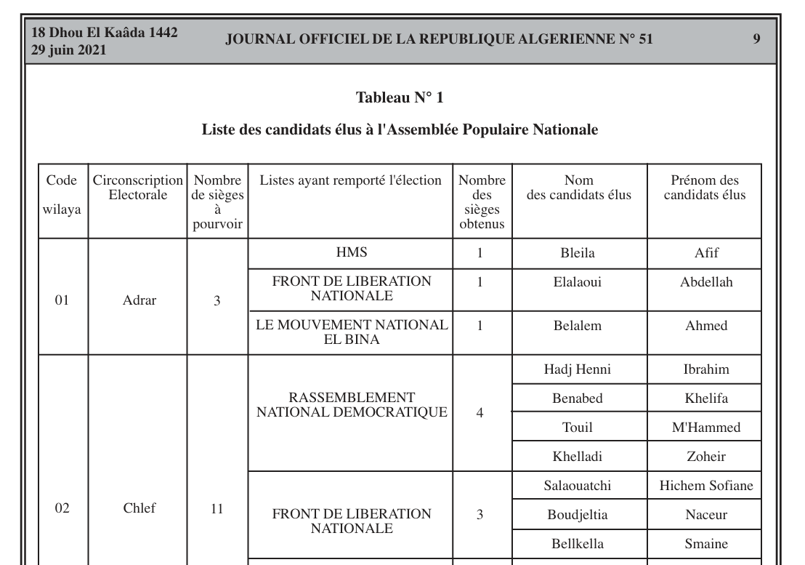

# Algerian Election Data

Part of my dissertation demonstrated a thoery linking water access to party system formation in the Middle East. Regions with limited water tend to practice nomadic pastoralism, which involves moving frequently through the desert with vulnerable cattle herds. To protect themselves, pastoralists tend to build very strong kin networks called tribes or clans encompassing tens or hundreds of thousands of "cousins". Today, these tribes are effective electoral vehicles and "compete" with parties for votes and political space. For example, Saudi Arabia is a "clan" state in the same way the Soviet Union was a "party state". I needed to show that this pattern is observable across different regions within the same state, so I turned to Algeria.

Algeria's 2020 elections saw approximately 20\% of seats go to independent, tribal candidates. I want to show that these independents come mainly from Algeria's arid, pastoralist south and not the wet, farmer-dominated north. 

The problem is that Algeria has very poor data, so everything I use will need to be scraped, transformed, and aggregated into a coherent rectangular dataset. I need to aggregate data from candidates, parties, districts and climate datasets all together. I decided to use this opportunity to show of my skills integrating data in different formats, particularly in SQL and Python.

Objective - For each district, find the proportion of winning candidates who come from small/independent party lists, and merge that with climate data for each district.

## Part 1: A Relational Database of Partisans

First, I need electoral data. Developing countries tend to release data through their "Official Journal", which is a sort of newspaper that the government publishes regularly with important announcements. The base data for candidates looks like this 



I transform it into a CSV and massage it into an appropriate format. This snippet creates the Candidates table and uploads from the CSV.

```sql
CREATE TABLE Candidates (
    candidate_id SERIAL PRIMARY KEY,
    last_name VARCHAR(50),
    first_name VARCHAR(50),
	party_list VARCHAR(100),
	party_id INTEGER,
	seats_party_wilaya INTEGER,
	wilaya VARCHAR(50),
	wilaya_id INTEGER,
	seats_wilaya INTEGER
);

COPY Candidates(wilaya_id, wilaya, seats_wilaya, party_list, seats_party_wilaya, last_name, first_name, candidate_id)
FROM 'C:\Program Files\PostgreSQL\17\data\algeria_candidates_csv.csv'
DELIMITER ','
CSV HEADER;
```

Next I use the candidates table to create a parties table.

```sql
CREATE TABLE pl (
    party_id SERIAL PRIMARY KEY,
    party_list VARCHAR(50),
    total_seats_2021 INTEGER,
	major_party BOOLEAN,
	minor_party BOOLEAN,
	independent_list BOOLEAN
	);

INSERT INTO pl (party_list)
SELECT DISTINCT party_list
FROM Candidates;	

UPDATE pl
SET total_seats_2021 = subquery.candidate_count
FROM (
    SELECT party_list, COUNT(*) AS candidate_count
    FROM Candidates
    GROUP BY party_list
) AS subquery
WHERE pl.party_list = subquery.party_list;
```

I  group the parties into three categories based on whether the electeds identified as partisans after entering office. The large parties are those with more than 10 seats, the minor parties have few seats but still call themselves parties, and the "independenets" are a residual category.

```sql
UPDATE pl
SET major_party = CASE
    WHEN total_seats_2021 >= 10 THEN TRUE
    ELSE FALSE
END;

UPDATE pl
SET minor_party = CASE
	WHEN party_list IN ('LA VOIX DU PEUPLE', 'FRONT DE LA BONNE GOUVERNANCE', 'PARTI DE LA LIBERTE ET DE LA JUSTICE
','El FEDJR EL JADID','PARTI DE LA LIBERTE ET DE LA JUSTICE','JIL JADID','FRONT DE L''ALGERIE NOUVELLE
','PARTI EL KARAMA','PARTI EL KARAMA',' FRONT NATIONAL ALGERIEN') THEN TRUE
	ELSE FALSE
END;

UPDATE pl
SET independent_list = CASE
	WHEN minor_party = FALSE AND major_party = FALSE THEN TRUE
	ELSE FALSE
END;

UPDATE Candidates
SET party_id = pl.party_id
FROM pl
WHERE Candidates.party_list = pl.party_list;
```

Next I mark the candidates with these party categories, because candidates can  be linked directly to the districts (wilayat in Arabic), unlike the parties.

```sql
ALTER TABLE Candidates
ADD COLUMN major_party BOOLEAN,
ADD COLUMN minor_party BOOLEAN,
ADD COLUMN independent BOOLEAN;

UPDATE Candidates
SET major_party = pl.major_party
FROM pl
WHERE Candidates.party_id = pl.party_id;

UPDATE Candidates
SET minor_party = pl.minor_party
FROM pl
WHERE Candidates.party_id = pl.party_id;

UPDATE Candidates
SET independent = pl.independent_list
FROM pl
WHERE Candidates.party_id = pl.party_id;

SELECT * FROM Candidates;
```
Finally, I create the table for districts (wilayat) and I take their candidate count by party type.

```sql
CREATE TABLE wl (
    wilaya_id SERIAL PRIMARY KEY,
    wilaya VARCHAR(50),
    total_seats_2021 INTEGER,
	seats_major_party INTEGER,
	seats_independent INTEGER,
	seats_minor_party INTEGER
	);

INSERT INTO wl (wilaya)
SELECT DISTINCT wilaya
FROM Candidates;	

UPDATE wl
SET total_seats_2021 = (
    SELECT COUNT(*)
    FROM Candidates
    WHERE Candidates.wilaya_id = wl.wilaya_id
);

UPDATE wl
SET seats_major_party = (
    SELECT COUNT(*)
    FROM Candidates
    WHERE Candidates.wilaya_id = wl.wilaya_id
    AND Candidates.major_party = TRUE
);

UPDATE wl
SET seats_minor_party = (
    SELECT COUNT(*)
    FROM Candidates
    WHERE Candidates.wilaya_id = wl.wilaya_id
    AND Candidates.minor_party = TRUE
);

UPDATE wl
SET seats_independent = (
    SELECT COUNT(*)
    FROM Candidates
    WHERE Candidates.wilaya_id = wl.wilaya_id
    AND major_party = FALSE
    AND minor_party = FALSE
);

SELECT * FROM wl;
```

## Climate data

Next, I need to integrate the climate data. It comes as a NetCDF file, which is quite difficult to work with.

```python
import netCDF4 as nc
import xarray as xr
import pandas as pd
from scipy.spatial import cKDTree
import numpy as np

import geopandas as gpd
import matplotlib.pyplot as plt

# Path to the GADM shapefile (replace with the actual path)
shapefile_path = 'C:/Users/liptr/Box/academic/Thesis/pastoralism_paper/algeria/gadm41_DZA_shp/gadm41_DZA_1.shp'

# Load the shapefile using geopandas
gdf = gpd.read_file(shapefile_path)

# Inspect the data to ensure it contains the correct boundaries
print(gdf.head())

# Plot the administrative boundaries
gdf.plot()

# Show the plot
plt.show()

# Plot the boundaries with a color map and add labels
fig, ax = plt.subplots(figsize=(10, 10))

# Plot the boundaries with a specific color map (e.g., 'Set3')
gdf.plot(ax=ax, cmap='Set3', edgecolor='black')

# Add labels to the map for each wilaya (if available)
for idx, row in gdf.iterrows():
    plt.annotate(s=row['NAME_1'], xy=row['geometry'].centroid.coords[0], 
                 horizontalalignment='center', fontsize=8)

# Show the plot
plt.show()

# Calculate the centroids for each wilaya
gdf['centroid'] = gdf.geometry.centroid

# Extract the latitude (Y) and longitude (X) of the centroids
gdf['centroid_lat'] = gdf.centroid.y
gdf['centroid_lon'] = gdf.centroid.x

# Create a new dataframe with wilaya names, centroid latitudes, and longitudes
centroids_df = gdf[['NAME_1', 'centroid_lat', 'centroid_lon']].copy()

# Rename the columns for clarity
centroids_df.columns = ['wilaya_name', 'centroid_lat', 'centroid_lon']

# Function to round to the nearest 0.25 degrees
def round_to_nearest_025(x):
    return round(x * 4) / 4
  
centroids_df['rounded_lat'] = centroids_df['centroid_lat'].apply(round_to_nearest_025)
centroids_df['rounded_lon'] = centroids_df['centroid_lon'].apply(round_to_nearest_025)

centroids_df

#------------ Integrating climate data ----------------#

netcdf_file = 'C:/Users/liptr/Box/academic/Thesis/pastoralism_paper/climate_data_algeria/climatology-pr-period-mean_era5-x0.25_era5-x0.25-historical_climatology_mean_1985-2014.nc'
nc_data = xr.open_dataset(netcdf_file)

# Extract latitude, longitude, and precipitation variables from the NetCDF data
precipitation = nc_data['climatology-pr-period-mean']

# Use xarray to extract the precipitation at these specific coordinates
precip_values = []
for _, row in centroids_df.iterrows():
    lat = row['rounded_lat']
    lon = row['rounded_lon']
    
    precip_value = precipitation.sel(lat=lat, lon=lon, method='nearest').values[0]
    precip_values.append(precip_value)

centroids_df['precipitation'] = precip_values

```

Now I just have to merge the two datasets by wilayat name and I am done. I did that in the regressions files in R, but this demo is already too long so I do not include that.

I did make a few cut maps of the districts colored by their precipitation and the independent portion of elected.s

```python
# Join the precipitation data to the GeoDataFrame based on wilaya_name
gdf = gdf.merge(centroids_df[['wilaya_name', 'precipitation']], left_on='NAME_1', right_on='wilaya_name')

fig, ax = plt.subplots(1, 1, figsize=(10, 10))
gdf.plot(column='precipitation', ax=ax, legend=True, cmap='Blues', edgecolor='black')
ax.set_title('Precipitation by Wilaya in Algeria', fontsize=15)
ax.set_axis_off()

plt.show()
```


I apply the same process to the independent seatshare by district to get a similar map.

